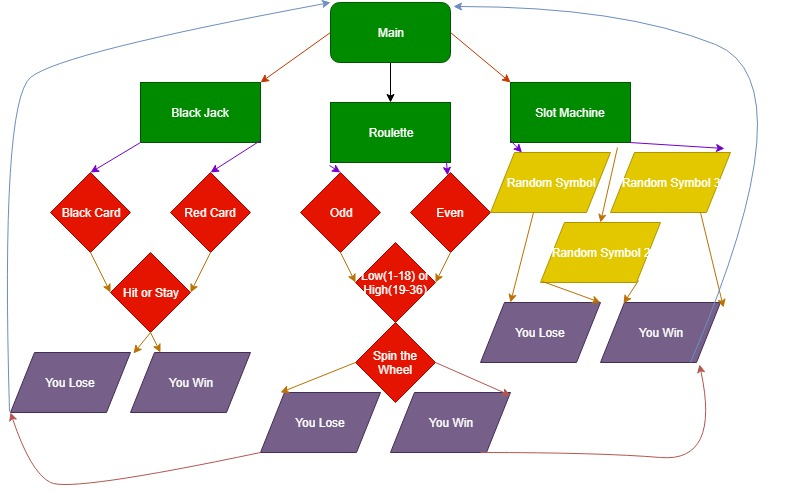

# Casino Games

Controls
Draw a black or red card
Choose to hit or stay
You win or lose

Choose odd or even
Choose high or low
Spin the wheel
You win or lose

Pull Lever
3 random symbols are generated
You win or lose
Getting Started
Follow these instructions to play these 3 casino games
Prerequisites
Current versions work on all platforms.
Installing
Follow these instructions to play
Click each program
Read steps to begin and play
Authors
Gavin Behel- Main Developer - GavinBehel138
Chance Niffen- Idea - chancemakeawish
License
This project is licensed under the GNU General Public License v3.0 - see the LICENSE.md file for details
Acknowledgments
Chance Niffen for blackjack
Gavin Behel for slot machines and roulette
